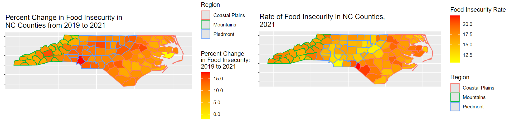

```{r load-packages, message = FALSE, warning = FALSE, echo = FALSE}
library(tidyverse) 
library(readxl)
library(tinytex)
library(tidymodels)
library(infer)
library(spdep)
library(lme4)
library(readr)
library(ggfortify)
library(haven)
library(yardstick)
library(broom)
library(knitr)
```
```{r load-data-and-mutate, message = F, warning = FALSE, echo = FALSE}
library(readxl)
finc <- read_excel("~/R/Team-E-T/data/finc.xlsx", sheet = " County Projections")

finc_glimpse <- finc

finc <- finc %>%
  mutate(`x100 FI 2019 Percent` = `FI 2019 Percent`* 100) %>%
  mutate(`x100 2021 FI Percent` = `2021 FI Percent`* 100)

finc <- finc %>%
  mutate(FI_Diff=`x100 2021 FI Percent`-`x100 FI 2019 Percent`) %>%
  mutate(FI_PC_Change= (FI_Diff/`FI 2019 Percent`))

finc <- finc %>%
  mutate(`Rural-urban Continuum Code`, Urban_cat = ifelse(`Rural-urban Continuum Code`%in% c("1","2","3"), "Urban", "Rural"))

finc$Urban_cat <- as_factor(finc$Urban_cat)
finc$Urban_cat=relevel(finc$Urban_cat, ref = "Urban")

finc <- finc %>%
  mutate(Greater10pc_change_FI_Diff = if_else(`FI_PC_Change`< 10, "0", "1"))

finc$Greater10pc_change_FI_Diff <- as_factor(finc$Greater10pc_change_FI_Diff)
finc$Greater10pc_change_FI_Diff=relevel(finc$Greater10pc_change_FI_Diff, ref = "0")

finc$Region <- as_factor(finc$Region)
finc$Region=relevel(finc$Region, ref = "Piedmont")
```

# Background and Research Questions, and Data Sources

The persistent issue of food insecurity is a complex but important factor in a person’s well-being and nutrition, and is an important social determinant of health. Food insecurity is defined by the Food and Agriculture Organization of the United Nations as lack of "regular access to enough safe and nutritious food for normal growth and development and for an active and healthy life." There are a variety of factors that have the potential to impact food security, both generally and in the context of the COVID-19 Pandemic. These questions in North Carolina, a growing and diversifying state, are all the more relevant as hunger relief organizations and public officials alike have been working to tackle the pandemic's many lasting effects in society, one of these being food insecurity. With this in mind, it is worth taking a step back to assess, based on data from a variety of sources, the degree of statistical support to emphasizing various factors' impact on food security, including temporally and during the pandemic itself.

This project's motivating research questions are the following:

**Does North Carolina County level data provide evidence to support that there has been a statistically significant change to food insecurity rates from 2019 to 2021, and if there is support, what is the magnitude of this change?**

**To what extent are the following variables able to predict North Carolinian county-level food insecurity rates and the rate's change from 2019 to 2021: unemployment change from 2019-2021, meal price in 2019, education level, level of broadband internet, race and ethnicity, and degree of urbanization? Are some variables better predictors of rate versus rate change and vice versa?**

**Finally, if there is evidence to support that there has been a statistically significant change to food insecurity rates from 2019 to 2021, to what extent are categorical variables detailed above able to predict a percent change of greater than 10% in food insecurity from 2019 to 2021, signifying a greater understanding into the most impacted areas of North Carolina during the two year period?**

Data directly related to food insecurity and change in employment in North Carolinian Counties in 2019 (generally referred to as "pre-COVID") and 2021 (generally referred to as "post-COVID") was sourced from Feeding America, the United States’ largest hunger relief organization, that compiles national, state, and local data on food insecurity as a part of the organization’s “Map the Meal Gap” and “Coronavirus and Food Security” Research Initiatives. Feeding America Data was sourced from here: https://www.feedingamerica.org/research/map-the-meal-gap/by-county

Data related to urbanization categories for North Carolinian counties was sourced from the USDA’s Economic Research Service and the results of the American Community Survey from 2015 to 2019. USDA Economic Research Service Data was sourced from here: https://www.ers.usda.gov/data-products/county-level-data-sets/download-data/

Data directly related to education levels and level of broadband internet at home in North Carolinian counties were sourced from My Future NC, a nonprofit intended to measure and provide policy recommendations related to educational attainments in North Carolina. My Future NC was sourced from here: https://dashboard.myfuturenc.org/county-data-and-resources/   

The results for these variables for each North Carolinian county were combined into one Excel sheet, as well as one variable where counties were manually coded for each of the three North Carolina Regions it falls into -- Coastal Plains, Piedmont, and Mountains (sourced here: https://www.ncpedia.org/geography/counties); this complete dataset was loaded into R for analysis.

\newpage

# Dataset Glimpse
```{r glimpse-data, echo=FALSE}
glimpse(finc_glimpse)
```

# Exploratory Data Analysis and Investigation Methodology

In order to investigate the first research question, a plot was constructed to determine the extent to explore the numerical, as well as geographic, distribution of the Percent Change in Food Insecurity in North Carolina, as well as the distribution of the Percent Change in Child Food Insecurity in North Carolina by county, both from 2019 to 2021.

```{r early-visual-1, message = FALSE, warning = FALSE, echo = FALSE, fig.show='hide'}
nc <- st_read(system.file("shapes/sids.shp", package="spData")[1], quiet=TRUE) %>%
rename(County = NAME)
nc_plot <- finc %>%
full_join(nc)

ggplot(data = nc_plot) +
  geom_sf(aes(fill= `FI_PC_Change`, color = Region, geometry = geometry)) +
  labs(title = "Percent Change in Food Insecurity in 
NC Counties from 2019 to 2021") +
scale_fill_continuous(low = "yellow", high = "red", name = "Percent Change 
in Food Insecurity: 
2019 to 2021", label = scales::comma) + 
  theme(axis.title.x=element_blank(), axis.text.x=element_blank(), axis.ticks.x=element_blank(),
        axis.title.y=element_blank(), axis.text.y=element_blank(), axis.ticks.y=element_blank() + theme(plot.title = element_text(size=8.5), plot.subtitle = element_text(size=8), axis.title=element_text(size=4)))

ggplot(data = nc_plot) +
  geom_sf(aes(fill= `x100 2021 FI Percent`, color = Region, geometry = geometry)) +
  labs(title = "Rate of Food Insecurity in NC Counties, 
2021") +
scale_fill_continuous(low = "yellow", high = "red", name = "Food Insecurity Rate", label = scales::comma) + 
theme(axis.title.x=element_blank(), axis.text.x=element_blank(), axis.ticks.x=element_blank(),
        axis.title.y=element_blank(), axis.text.y=element_blank(), axis.ticks.y=element_blank() + theme(plot.title = element_text(size=8.5), plot.subtitle = element_text(size=8), axis.title=element_text(size=4)))
```
```{r maps, echo=FALSE, message=FALSE, warning=FALSE, out.width="100%"}

```
Note: NC Map Data sourced from https://r-spatial.github.io/spdep/articles/sids.html

Being able to explore the percent change in food insecurity for the counties in and around the Charlotte and Triangle area as opposed to the more rural Eastern and Western portions of the state reveal interesting results. For example, there was a rise in food security in the urban areas surrounding Charlotte, but not in Eastern North Carolina, and there was a county that appears to have decreased in food insecurity in the pandemic.

To investigate the differences in 2019 and 2021 Food Insecurity Percent Changes, a 1 Sample 2-Sided T-Test was run on two different variables: a paired variable that was the difference in 2021 from 2019 Food Insecurity Data per county, and a derived variable that calculated percent change, or difference divided by the 2019 rate, per county from 2019 to 2021 based on the paired percent difference variable. A 95% Confidence Interval for the true percent difference and percent change in food insecurity rates for North Carolina counties will be obtained from running this test as well. For both of these tests, the following null hypothesis was used: $H_0: \mu_{2019} = \mu_{2021}$, versus $H_A: \mu_{2019} \neq \mu_{2021}$

To further investigate the impact of other variables to food insecurity rates and change in food insecurity rates, two linear regression model will be fit in order to model the following: $$\hat{y}_i = \hat{\beta}_0 + \hat{\beta}_1(meal_i) + \hat{\beta}_2(urban_i) + \hat{\beta}_3({\Delta}unemp_i) + \hat{\beta}_4(<hs_i) + 
\hat{\beta}_5({=}hs) + \hat{\beta}_6(somecollege) + \hat{\beta}_7(degree)$$
$$+ \hat{\beta}_8(hhincome) + \hat{\beta}_9(region) + \hat{\beta}_{10}(internet) + \hat{\beta}_{11}(hispanic) + \hat{\beta}_{12}(white)$$
Where the response variable for one linear regression model is food insecurity rates in 2021 and the other is the change in food insecurity in North Carolinian counties from 2019 to 2021.

The residual plot and R^2 Adjusted Term will be determined for both linear regressions as well in order to confirm that there are not any irregularities with the regression that hinders the model's validity. Any concerns will warrant further investigation

Once a valid linear regression is fitted for both response variables, significant predictor variables based on p-values and confidence intervals will be isolated and interpreted in context. Those that are deemed based on the linear regression to be significant will be fitted on a new single linear regression and interaction terms among these remaining variables will be assessed to determine greater fit based upon the $R^2$ adjusted calculation yielded.

Among the significant variables that are determined to be significant, regeression models for those preictor variables will be fit with interactions, with multiple combinations being run among these to determine which of these models with an interaction term yields the greatest R^2 term. This eventual linear regression model will be interpreted in context.

Regardless of statistical significance of particular variables in the above term, it is also of interest to explore the impact that particular categorical predictor variables, and derived categorical variables from numerical predictor variables, have on our response variables of interest. One such variable is investigating the three major regions of North Carolina (Coastal Plains, Piedmont, and Mountains) for true differences in means of food insecurity rates.

```{r anova-visuals, message = FALSE, warning = FALSE, echo = FALSE, fig.show='hide'}
finc %>%
  ggplot(aes(x = `x100 2021 FI Percent`,
             y = Region)) +
  geom_boxplot() +
  labs(
    x = "2021 County Food Insecurity Rates",
    y = NULL, 
    title = "2021 County Food Insecurity Rates",
    subtitle = "By NC Region"
  )

finc %>%
  ggplot(aes(x = `FI_PC_Change`,
             y = Region)) +
  geom_boxplot() +
  labs(
    x = "2019-2021 County Food Insecurity Rate Percent Change",
    y = NULL, 
    title = "2019-2021 County Food Insecurity Rate Percent Change",
    subtitle = "By NC Region"
  )
``` 
```{r boxplots, echo=FALSE, message=FALSE, warning=FALSE, out.width="100%"}

```

Based on the boxplots above, the medians of the three North Carolina Regions' food insecurity rates appear to be different, with the Piedmont in particular appearing to have the lowest median county food insecurity rate in 2021, while at the same time having the highest median food insecurity rate percent change from 2019 to 2021. The plan is to use a one-way ANOVA to test the overall hypothesis of no difference in mean county food insecurity rates and county food insecurity percent changes, with planned step-down tests using a Holm correction for multiple comparisons if the overall hypothesis is rejected. Conditions of an ANOVA of relatively equal variances and normal distribution appear have been verified. Independence is furthermore assumed to be independent for the purposes of this statistical test, though it is worth recognizing that affluence of neighboring counties may have an impact on the ability of food insecurity measures to be independent from one county to the next.

Another investigation was desired into the impact of urbanness and region on a modified version of the County 2019-2021 Food Insecurity Percent Change form 2019 to 2021 that was a binary indicator of whether a particular county had experienced a percent change of greater than 10% from 2019 to 2021, signifying the most impacted counties as a result of the events within the 2 year period.

```{r log_plot, message = FALSE, warning = FALSE, echo = FALSE, fig.show='hide'}
finc <- finc %>%
mutate(plot_Greater10pc_change_FI_Diff = if_else(Greater10pc_change_FI_Diff == "0", "Less Than 10%", "Greater Than 10%"))

ggplot(finc, aes(x = Urban_cat, 
                  fill = plot_Greater10pc_change_FI_Diff)) +
  geom_bar(position = "fill") +
  labs (
    x = "NC Urban/Rural County Status",
    y = "Proportion",
    fill = "Experienced
Greater than
10% Increase
In Food Insecurity
During Pandemic",
    title = "NC Counties by Greater than 10% Food Security Increase 
In Pandemic and Rural/Urban Status",
)

ggplot(finc, aes(x = Region, 
                  fill = plot_Greater10pc_change_FI_Diff)) +
  geom_bar(position = "fill") +
  labs (
    x = "NC Region",
    y = "Proportion",
    fill = "Experienced
Greater than
10% Increase
In Food Insecurity
During Pandemic",
    title = "NC Counties by Greater than 10% Food Security Increase 
In Pandemic and NC Region",
)
```
```{r stacked, echo=FALSE, message=FALSE, warning=FALSE, out.width="100%", fig.align='center'}
knitr::include_graphics("finc_2stacked.png")
```

Assessing the boxplots above for region and urbanness respectively, there does indeed appear to be a connection between NC Region and having a percent change of food insecurity rate greater than 10%, with nearly all Piedmont county regions, but less than 25% of Mountain and Coastal Plains counties, having a percent change of food insecurity rate greater than 10%; similarly, it appears that Urban counties were more likely to have a percent change of food insecurity rate greater than 10%.

In order to test the statistical significance of these findings further, a logistic regression model was developed to follow the following where `urban` refers to a binary urban or non-urban, while `region` refers to a categorical variable with three levels and the Piedmont Region as the referent group:

$$\log(\frac{\pi_i}{1-\pi_i}) = \hat{\beta}_0 + \hat{\beta}_1(urban_i) + \hat{\beta}_2(region_i) $$
Significant results will be interpreted in context; due to there being only 100 counties in North Carolina, it was determined that using an ROC curve based on training and test data was impractical for this particular model, and thus was not performed.

Note that for all testing and model fitting, the significance level has been defined as $\alpha = 0.05$, and all confidence intervals will be of 95% significance.


# T-test Results

```{r run t-tests, message = FALSE, warning = FALSE, echo = FALSE}
t.test(finc$FI_Diff, mu=0) %>%
  tidy() %>%
knitr::kable(caption= "1 Sample Paired 2-Sided T-Test Testing Null Hypothesis of a True Percent Difference from 2019 to 2021 Food Insecurity Rates for NC Counties")

t.test(finc$FI_PC_Change, mu=0) %>%
  tidy() %>%
knitr::kable(caption= "1 Sample 2-Sided T-Test Testing Null Hypothesis of a True Percent Change from 2019 to 2021 Food Insecurity Rates for NC Counties")
```

For the first T-test and 95% Confidence Interval for paired variable that was the simple difference in 2021 from 2019 NC County Food Insecurity rates, a p-value of essentially 0 was obtained, and 0 is not within the confidence interval for this paired t-test. Therefore, we reject the null hypothesis, that $H_0: \mu_{2019} = \mu_{2021}$, as there is evidence to suggest that there was a statistically significant difference in food insecurity rates between 2019 and 2021 reports paired by county. This t-test yielded an estimate of the percent difference in food insecurity rates from 2019 in 2021 in North Carolinian counties to be 1.415 (95% CI: (1.33358, 1.49642)) percent.

For the second T-test and 95% Confidence Interval for the variable that was the percent chenge in 2021 from 2019 NC County Food Insecurity rates, a p-value of essentially 0 was obtained, and 0 is not within the confidence interval for this t-test. Therefore, we reject the null hypothesis, that $H_0: \mu_{2019} = \mu_{2021}$, as there is evidence to suggest that there was a statistically significant difference in food insecurity percent changes between 2019 and 2021 reports for each NC county. This t-test yielded an estimate of the percent change in food insecurity rates from 2019 in 2021 in North Carolinian counties to be a percent increase of 9.706158 (95% CI: (9.126484, 10.28583)) percent.

# Linear Regression Results

```{r run_regression_0, message = FALSE, warning = FALSE, echo = FALSE, fig.show='hide'}

finc$Region=as.factor(finc$Region)

finc$Region=relevel(finc$Region, ref = "Piedmont")

finc_linear_1 <- linear_reg() %>%
  set_engine("lm") %>%
  fit(`FI_PC_Change` ~ `2019 Cost per Meal` + `Urban_cat` + `Unemployment Change` + `Percent Less than HS` + `HS or GED` + `Some College, No Degree` + `Household Income` + `Region` + `Percent Broadband Internet at Home` + `Hispanic` + `Percent non-Hispanic White`, data = finc)

finc_linear_1_aug <- augment(finc_linear_1$fit)
ggplot(finc_linear_1_aug, mapping = aes(x = .fitted, y = .resid)) +
  geom_point(alpha = 0.5) +
  geom_hline(yintercept = 0, color = "gray", lty = "dashed") +
  labs(x = "2019 to 2021 Food Inscurity Percent Change by NC County", 
       y = "Residuals", 
       title = "Residuals of Linear Regression for 2019 to 2021 
Food Inscurity Percent Change by NC County")


finc_linear_2 <- linear_reg() %>%
  set_engine("lm") %>%
  fit(`x100 2021 FI Percent` ~ `2019 Cost per Meal` + `Urban_cat` + `Unemployment Change` + `Percent Less than HS` + `HS or GED` + `Some College, No Degree` + `Household Income` + `Region` + `Percent Broadband Internet at Home` + `Hispanic` + `Percent non-Hispanic White`, data = finc)

finc_linear_2_aug <- augment(finc_linear_2$fit)
ggplot(finc_linear_2_aug, mapping = aes(x = .fitted, y = .resid)) +
  geom_point(alpha = 0.5) +
  geom_hline(yintercept = 0, color = "gray", lty = "dashed") +
  labs(x = "2021 Food Inscurity Rates by NC County", 
       y = "Residuals", 
       title = "Residuals of Main Linear Regression of Food Insecurity Rates in NC, 
2021")
```
```{r linear_residual, echo=FALSE, message=FALSE, warning=FALSE, out.width="100%"}

```

The residual plots generated above for the two linear regression models specified in the Investigation Methodology generates plots that appear to have residuals distributed randomly around 0, with a generally even split above and below a residual value of 0.0. In addition, there does not appear to be a pattern in the residual around the x or y axis for either plot; in other words, there seems to generally be a “cloud” for the residual plot with no concerning patterns for both plots. Thus, based on the residual plot, there does not seem to be an overall concern with the linear regression models generated based off of the proposed Investigation Methodology.

```{r table_ln_1, message = FALSE, warning = FALSE, echo = FALSE}
finc_linear_1 %>% tidy(conf.int=TRUE) %>% 
select(term, estimate, p.value, conf.low, conf.high) %>%
knitr::kable(caption="Findings of Main Linear Regression of Food Insecurity Change in North Carolina, 2019-2021")

glance(finc_linear_1)$adj.r.squared
```

Given an Adjusted $R^2$ Adjusted Value of 0.94395, we can say that approximately 94.395% of the variation found in the response variable of NC county food insecurity percent change from 2019 to 2021 can be explained by the regression model using the above selected explanatory variables. In context, this in turn means that our linear regression modeling these variables together does explain most (>50%) of the variability of NC county food insecurity percent change from 2019 to 2021.

Using a significance level of $\alpha = 0.05$, based on the p-values obtained for the main linear regression model developed using the percent change of food insecurity for North Carolinian counties from 2019 to 2021 as the response variable, the following variables were found not to be a statistically significant predictive impact on the percent change in food insecurity incurred at the county level from 2019 to 2021: a 2019 per county cost per meal estimate, the percent of county adults with an educational level less than a High School Degree, the percent of county adults with an educational level at a High School Degree or GED but no more, the percent of county adults with an educational level recognized as some college having been completed, a categorical comparison of NC Mountains County residents to Piedmont residents, the percent of county residents with broadband internet connection at home, and the percent of county residents categorized as "Hispanic".

Based on the variables found to be significant, the following interpretations based on the linear regression model can be made:

All other factors in the model held constant, counties identified as urban, as categorized by the USDA, as opposed to counties identified as rural, are predicted, on average, to have a food insecurity percent change from 2019 to 2021 that is higher by 0.4624725 percent, or a change of (+)0.4624725 (95% CI: (0.0951767, 0.8297684)) percent in food insecurity for being an urban country as opposed to rural. Given the relatively small change of less than a percent change predicted by the 95% Confidence Interval, this finding could be viewed as statistically significant, but not practically significant in terms of practical interpretation of this predictor variable.

All other factors in the model held constant, for each one percent increase in the unemployment change from 2019 to 2021 for a North Carolinian county, it is predicted that, on average, there will be a food insecurity percent change from 2019 to 2021 that is higher by 2.93967 percent, or a change of (+)2.93967 (95% CI: (2.6982667, 3.1810744)) percent in food insecurity for a one percent increase in county unemployment rate.

All other factors in the model held constant, for each one dollar increase in the average household income for a North Carolinian county, it is predicted that, on average, there will be a food insecurity percent change from 2019 to 2021 that is higher by 0.0001046 percent, or a change of (+)0.0001046 (95% CI: (0.0000724, 0.0001368)) percent in food insecurity for a one dollar increase in household income. Another way to interpret this more practically is that there is a predicted change of (+)1.046 (95% CI: (0.724, 1.368)) percent in food insecurity for each 10,000 dollar increase in household income.

All other factors in the model held constant, counties identified as being in the Coastal Plains Region of the state of North Carolina, as opposed to counties identified as being in the Piedmont Region of the state of North Carolina, are predicted, on average, to have a food insecurity percent change from 2019 to 2021 that is lower by 0.6595482 percent, or a change of -0.6595482 (95% CI: (-1.0595938, -0.2595027)) percent in food insecurity for being a Coastal Plains of NC county as opposed to Piedmont NC county.

All other factors in the model held constant, for each one percent increase in the percent Non-Hispanic White for a North Carolinian county, it is predicted that, on average, there will be a food insecurity percent change from 2019 to 2021 that is lower by 0.0193167 percent, or a change of (-)0.0193167 (95% CI: (-0.0322718, -0.0063615)) percent in food insecurity for a one percent increase in non-Hispanic Whites in an NC county. Given the relatively small change of much less than a percent change predicted by the 95% Confidence Interval, this finding should be viewed as statistically significant, but not practically significant in terms of practical interpretation of this predictor variable.

```{r table_ln_2, message = FALSE, warning = FALSE, echo = FALSE}
finc_linear_2 %>% tidy(conf.int=TRUE) %>% 
select(term, estimate, p.value, conf.low, conf.high) %>%
knitr::kable(caption="Findings Main Linear Regression of Food Insecurity Rates by NC County, 2021")

glance(finc_linear_2)$adj.r.squared
```

Given an Adjusted $R^2$ Adjusted Value of 0.8074312, we can say that approximately 80.74312% of the variation found in the response variable of 2021 NC county food insecurity rates can be explained by the regression model using the above selected explanatory variables. In context, this in turn means that our linear regression modeling these variables together does explain most (>50%) of the variability of NC county food insecurity percent change from 2019 to 2021, but is comparatively not as strong as a model to explain variability compared to predicting NC county food insecurity percent change from 2019 to 2021, given that the same predictor variables were used for both linear regression models.

Using a significance level of $\alpha = 0.05$, based on the p-values obtained for the main linear regression model developed using the rate of food insecurity for North Carolinian counties in 2021 as the response variable, the following variables were found not to be a statistically significant predictive impact on the rates of food insecurity incurred at the county level in 2021: a 2019 per county cost per meal estimate, a classification by the USDA of urban/rural NC County status, the percent of county adults with an educational level at a High School Degree or GED but no more, the percent of county adults with an educational level recognized as some college having been completed, a categorical comparison of NC Mountains County residents to Piedmont residents, the percent of county residents with broadband internet connection at home, the percent of county residents categorized as "Hispanic", and the percent of county residents categorized as "non-Hispanic White".

Based on the variables found to be significant, the following interpretations based on the linear regression model can be made:

All other factors in the model held constant, for each one percent increase in the unemployment change from 2019 to 2021 for a North Carolinian county, it is predicted that, on average, there will be a 2021 food insecurity rate change that is higher by 0.6459854 percent, or a change of (+)0.6459854 (95% CI: (0.3316770, 0.9602938)) percent in 2021 county food insecurity rate for a one percent increase in county unemployment rate.

All other factors in the model held constant, for each one percent increase in the share of county residents whose highest education level is less than a High School Diploma for a North Carolinian county, it is predicted that, on average, there will be a 2021 food insecurity rate change that is higher by 6.567276 percent, or a change of (+)6.567276 (95% CI: (1.1211122, 12.0134398)) percent in 2021 county food insecurity rate for a one percent increase in county unemployment rate the share of county residents whose highest education level is less than a High School Diploma for a North Carolinian county.

All other factors in the model held constant, for each one dollar increase in the average household income for a North Carolinian county, it is predicted that, on average, there will be a 2021 NC county food insecurity rate percent change that is lower by 0.0001046 percent, or a change of (+)0.0001371 (95% CI: (0.000179, 0.0000952)) percent in 2021 NC county food insecurity for a one dollar increase in household income. Another way to interpret this more practically is that there is a predicted change of (-)1.371 (95% CI: (-1.79, -0.952)) percent in 2021 food insecurity rates for each 10,000 dollar increase in household income for a North Carolinian county.

All other factors in the model held constant, counties identified as being in the Coastal Plains Region of the state of North Carolina, as opposed to counties identified as being in the Piedmont Region of the state of North Carolina, are predicted, on average, to have a 2021 NC county food insecurity rate that is higher by 0.6780321 percent, or a change of 0.6780321 (95% CI: (0.1571718, 1.1942164)) percent in 2021 NC county food insecurity rate for being a Coastal Plains of NC county as opposed to Piedmont NC county.

```{r linear-extended-1, message = FALSE, warning = FALSE, echo = FALSE}
finc_linear_3 <- linear_reg() %>%
  set_engine("lm") %>%
  fit(`FI_PC_Change` ~ `Urban_cat` + `Percent non-Hispanic White` + `Household Income` * `Unemployment Change`  + `Region` , data = finc)

finc_linear_3 %>% tidy(conf.int=TRUE) %>% 
select(term, estimate, p.value, conf.low, conf.high) %>%
knitr::kable(caption="Findings: Interaction Linear Regression of Food Insecurity Rates by NC County, 2021")

glance(finc_linear_3)$adj.r.squared
```

Restricting to only significant predictor variables from the first linear regression attempting to model NC county food insecurity percent change from 2019 to 2021 and testing different interaction pairs to see which model increase the $R^2$ value the greatest, the interaction term that had the greated increase on the $R^2$ variable is the one that entails an interaction between Household Income and Unemployment Change, with an $R^2 = 0.9591522$ compared to the earlier main effects model of $R^2 = 0.9439508$. This is to say that the rate of change in NC county food insecurity percent change from 2019 to 2021 as household income increases does vary between residents of low unemployment change and high unemployment change, and those in higher changes in unemployment from 2019 to 2021 have generally higher levels of NC county food insecurity percent change from 2019 to 2021 than those in counties with lower changes in unemployment from 2019 to 2021.

```{r linear-extended-2, message = FALSE, warning = FALSE, echo = FALSE}
finc_linear_4 <- linear_reg() %>%
  set_engine("lm") %>%
  fit(`x100 2021 FI Percent` ~ `Unemployment Change` * `Household Income` + `Percent Less than HS` + `Region`, data = finc)

finc_linear_4 %>% tidy(conf.int=TRUE) %>% 
select(term, estimate, p.value, conf.low, conf.high) %>%
knitr::kable(caption="Findings: Interaction Linear Regression of Food Insecurity Rates by NC County, 2021")

glance(finc_linear_4)$adj.r.squared
```

Restricting to only significant predictor variables from the first linear regression attempting to model 2021 NC county food insecurity rates and testing different interaction pairs to see which model increase the $R^2$ value the greatest, the interaction term that had the greated increase on the $R^2$ variable is the one that entails an interaction between Household Income and Unemployment Change, with an $R^2 = 0.811756$ compared to the earlier main effects model of $R^2 = 0.8074312$. However, the interaction term itself is not significant, with a p-value greater than $alpha = 0.05$. Thus, for this term, we fail to reject the null hypothesis and conclude that there is not enough evidence to disprove that generally a rise in 2021 NC county food insecurity rates for those with a higher unemployment rate and higher than average household income is equal to the rise in 2021 NC county food insecurity rates for those with a higher unemployment rate and lower than average household income.

# Logistic Regression Results

```{r run_log_regression_1, message = FALSE, warning = FALSE, echo = FALSE}

fs_percentchange_1_fit <- logistic_reg() %>%
  set_engine("glm") %>%
  fit(Greater10pc_change_FI_Diff ~ Urban_cat + Region, data = finc, family = "binomial")
tidy(fs_percentchange_1_fit,conf.int=TRUE) %>%
  mutate(
    odds = exp(estimate),
    conf.low.exp = exp(conf.low),
    conf.high.exp = exp(conf.high)
  ) %>% 
  select(term, odds, p.value, conf.low.exp, conf.high.exp) %>%
knitr::kable(caption="Results of Logistic Regression Table Determining Odds 
of Food Security Change During Pandemic Greater than 10% by Urban-Rural Status")
```

Based on the Results of our Logistic Regression predicting NC counties that experienced an increase in percent change in food insecurity of greater than 10% by categorical variables of urban/rural status and NC region, we would expect the odds that an urban county experienced a percent change in food insecurity rates greater than 10% to multiply by 0.2500597 (95% CI: (0.0882517, 0.6744302)) compared to someone a rural county, holding all else constant. This result is statistically significant, judging by a p-value of 0.0069972 < 0.05 and "1" not being in our 95% Confidence Interval. 

Furthermore, we would expect the odds that an NC Coastal Plains county experienced a percent change in food insecurity rates greater than 10% to multiply by 0.0791916 (95% CI: (0.0227977, 0.2393519)) compared to a Piedmont county, holding all else constant. This result is statistically significant, judging by a p-value of 0.0000194 < 0.05 and "1" not being in our 95% Confidence Interval. Similarly, we would expect the odds that an NC Mountains county experienced a percent change in food insecurity rates greater than 10% to multiply by 0.0858129 (95% CI: (0.0195965,0.3214392)) compared to a Piedmont county, holding all else constant. This result is statistically significant, judging by a p-value of 0.0005011 < 0.05 and "1" not being in our 95% Confidence Interval.

These results collectively can be interpreted to say that there is evidence to conclude that there is a significantly lower odds of having a percent change in food insecurity rates from 2019 to 2021 of greater than 10% for rural counties opposed to urban counties and for both Coastal Plains and Mountains Counties opposed to Piedmont Counties.

# Concluding Remarks

Thinking about the research questions that were posed as a part of this report, general conclusions can be summarized as the following:

Using $\alpha = 0.05$, there is significance to support the conclusion that there was a significant increase in NC county food insecurity rates from 2019 to 2021 of at least 1% and a percent change of at least 9%.

The following variables were found **not** to be a statistically significant predictive impact on neither rates of percent change of food insecurity rates from 2019 to 2021 and rates of food insecurity incurred at the NC county level in 2021: **a 2019 per county cost per meal estimate, the percent of county adults with an educational level at a High School Degree or GED but no more, the percent of county adults with an educational level recognized as some college having been completed, a categorical comparison of NC Mountains County residents to Piedmont residents, the percent of county residents with broadband internet connection at home, and the percent of county residents categorized as "Hispanic".**

The following variables were found to be a statistically significant predictive impact on both rates of percent change of food insecurity rates from 2019 to 2021 and rates of food insecurity incurred at the NC county level in 2021: **Change in County Unemployment Rate from 2019 to 2021, Average County Household Income Estimate, and being in the Coastal Plains vs. Piedmont Region of North Carolina.**

The variables of **Rural vs Urban Status and County level percent non-Hispanic White** was significantly only for percent change from 2019 to 2021 for NC counties, while the variable of **Percent Share of County adults Whose highest education level is less than a High School Diploma** was signficant only for 2021 NC county food insecurity rates.

Interaction Terms of **Change in County Unemployment Rate from 2019 to 2021 and Average County Household Income Estimates** lead to a stronger linear regression model.

There is a significantly lower odds of having a percent change in food insecurity rates from 2019 to 2021 of greater than 10% for **rural** counties opposed to urban counties and for **both Coastal Plains and Mountains** Counties opposed to Piedmont Counties.

It is important to recognize that this report intended from the onset to investigate the state of food insecurity in the state of North Carolina. Since this report represents statistical testing and reporting where $n=100$, as there are only 100 counties in North Carolina, which impacts the degree to which testing and modelling can truly be applied in terms of the size of each factor for categorical variables. In addition, t-tests and models were constructed with an assumption of independence among observations (in this report, specific counties). However, it is highly likely that all variables are potentially influenced on adjacent counties, meaning that it is possible the value for one variable for a highly influential county may impact the value for that same variable in an adjacent county. In addition, given how data was sourced from multiple locations, it is possible that independence cannot be guaranteed for all variables regardless.  If samples are not independent, the results of our analysis may not
be accurate. Given the desire to focus on North Carolina, though, this was a necessary sacrifice to construct this report and investigate the research questions.
