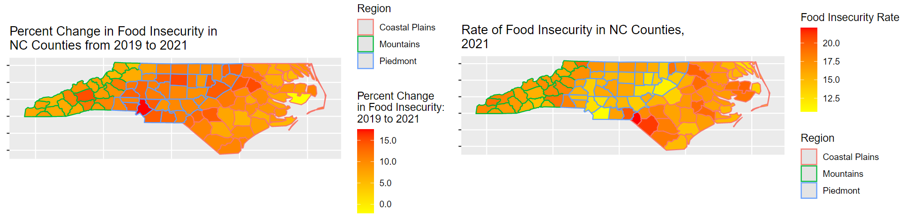
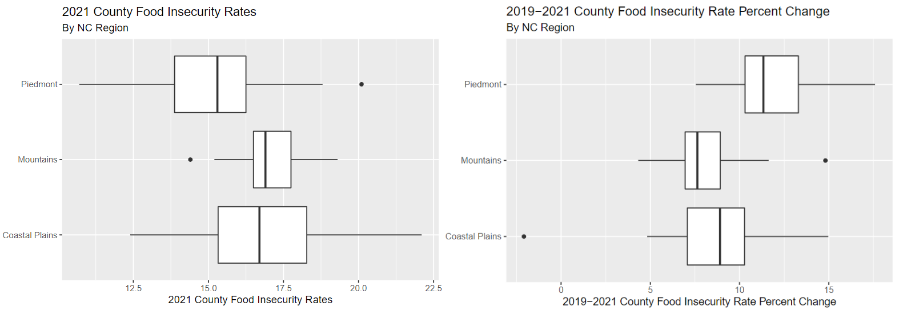
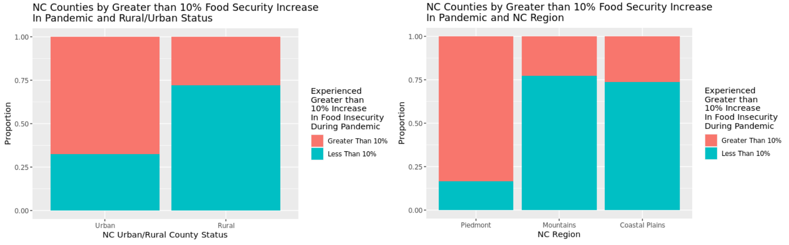

```{css, echo = FALSE}
.remark-slide-content {
  font-size: 16px;
  padding: 10px 40px 10px 40px;
}
.remark-code, .remark-inline-code {
  background: #f0f0f0;
}
.remark-code {
  font-size: 16px;
}
.huge .remark-code { /*Change made here*/
  font-size: 24px !important;
}
.tiny .remark-code { /*Change made here*/
  font-size: 12px !important;
}
```

```{r load-packages, include = FALSE}
# Add any additional packages you need to this chunk
# Remove any packages from this list that you're not using
library(tidyverse)
library(tidymodels)
library(knitr)
library(xaringanthemer)
library(xaringan)
library(tidyverse) 
library(readxl)
library(tinytex)
library(infer)
library(spdep)
library(lme4)
library(readr)
library(ggfortify)
library(haven)
library(yardstick)
library(broom)
```

```{r setup, include=FALSE}
# For better figure resolution
knitr::opts_chunk$set(
  fig.retina = 3, 
  dpi = 300, 
  fig.width = 6, 
  fig.asp = 0.618, 
  out.width = "70%"
  )
# code sources for this from: https://community.rstudio.com/t/using-multiple-font-sizes-for-code-chunks/26405
```

```{r load-data, include=FALSE}
library(readxl)
finc <- read_excel("~/R/Team-E-T/data/finc.xlsx", sheet = " County Projections")

finc_glimpse <- finc

finc <- finc %>%
  mutate(`x100 FI 2019 Percent` = `FI 2019 Percent`* 100) %>%
  mutate(`x100 2021 FI Percent` = `2021 FI Percent`* 100)

finc <- finc %>%
  mutate(FI_Diff=`x100 2021 FI Percent`-`x100 FI 2019 Percent`) %>%
  mutate(FI_PC_Change= (FI_Diff/`FI 2019 Percent`))

finc <- finc %>%
  mutate(`Rural-urban Continuum Code`, Urban_cat = ifelse(`Rural-urban Continuum Code`%in% c("1","2","3"), "Urban", "Rural"))

finc$Urban_cat <- as_factor(finc$Urban_cat)
finc$Urban_cat=relevel(finc$Urban_cat, ref = "Urban")

finc <- finc %>%
  mutate(Greater10pc_change_FI_Diff = if_else(`FI_PC_Change`< 10, "0", "1"))

finc$Greater10pc_change_FI_Diff <- as_factor(finc$Greater10pc_change_FI_Diff)
finc$Greater10pc_change_FI_Diff=relevel(finc$Greater10pc_change_FI_Diff, ref = "0")

finc$Region <- as_factor(finc$Region)
finc$Region=relevel(finc$Region, ref = "Piedmont")
```

```{r style-slides, echo = FALSE}
style_xaringan(
  title_slide_background_image = "img/darkfield.jpg"
)
```

## Food Insecurity

- Food insecurity is defined by the Food and Agriculture Organization of the United Nations as lack of "regular access to enough safe and nutritious food for normal growth and development and for an active and healthy life."

- Project inspired by a desire to investigate COVID-19's impact on Food Security in North Carolina, a growing and diversifying state that serves as a pertinent case study to the factors impacting multiple dimensions of food insecurity rates


```{r maps, echo = FALSE, out.width = "125%", fig.align = "center"}

```

---

## Research Questions
.huge[
- Does North Carolina County level data provide evidence to support that there has been a statistically significant change to food insecurity rates from 2019 to 2021, and if there is support, what is the magnitude of this change?

- To what extent are the following variables able to predict North Carolinian county-level food insecurity rates and the rate's change from 2019 to 2021: unemployment change from 2019-2021, meal price in 2019, education level, level of broadband internet, race and ethnicity, and degree of urbanization? Are some variables better predictors of rate versus rate change and vice versa? Which variables are not strong predictors at all? Are any statistically but not practically significant?

- Finally, if there is evidence to support that there has been a statistically significant change to food insecurity rates from 2019 to 2021, to what extent are categorical variables of urban/rural status and NC Region able to predict a percent change of greater than 10% in food insecurity from 2019 to 2021, signifying a greater understanding into the most impacted areas of North Carolina during the two year period?
]
---

## Research Questions

- Does North Carolina County level data provide evidence to support that there has been a statistically significant change to food insecurity rates from 2019 to 2021, and if there is support, what is the magnitude of this change? -> T-Test

- To what extent are the following variables able to predict North Carolinian county-level food insecurity rates and the rate's change from 2019 to 2021: unemployment change from 2019-2021, meal price in 2019, education level, level of broadband internet, race and ethnicity, and degree of urbanization? Are some variables better predictors of rate versus rate change and vice versa? Which variables are not strong predictors at all? Are any statistically but not practically significant? -> Linear Regression

- Finally, if there is evidence to support that there has been a statistically significant change to food insecurity rates from 2019 to 2021, to what extent are categorical variables of urban/rural status and NC Region able to predict a percent change of greater than 10% in food insecurity from 2019 to 2021, signifying a greater understanding into the most impacted areas of North Carolina during the two year period? -> Logistic Regression

---

## Dataset Glimpse

```{r glimpse-data, echo=FALSE}
glimpse(finc_glimpse)
```

---
## T-Test Setup

- **Does North Carolina County level data provide evidence to support that there has been a statistically significant change to food insecurity rates from 2019 to 2021, and if there is support, what is the magnitude of this change?**

- 1 Sample 2-Sided T-Test was run on two different variables: a paired variable that was the **difference in 2021 from 2019 Food Insecurity Data per county**, and a derived variable that calculated **percent change**, or difference divided by the 2019 rate, per county from 2019 to 2021 based on the paired percent difference variable. 

- A 95% Confidence Interval for the true percent difference and percent change in food insecurity rates for North Carolina counties calculated. 

- The following null hypothesis was used: $H_0: \mu_{2019} = \mu_{2021}$, versus $H_A: \mu_{2019} \neq \mu_{2021}$

---
## T-Test: Difference in Food Insecurity Rates

```{r t-test-1, echo=FALSE}
t.test(finc$FI_Diff, mu=0) %>%
  tidy() %>%
knitr::kable(caption= "1 Sample Paired 2-Sided T-Test Testing Null Hypothesis of a True Percent Difference from 2019 to 2021 Food Insecurity Rates for NC Counties")


```

- There is evidence to suggest that there was a statistically significant difference in food insecurity rates between 2019 and 2021 reports paired by county. This t-test yielded an estimate of the percent difference in food insecurity rates from 2019 in 2021 in North Carolinian counties to be 1.415 (95% CI: (1.33358, 1.49642)) percent.

---

## T-Test: Difference in Food Insecurity Rate Percent Change

```{r t-test-2, echo=FALSE}
t.test(finc$FI_PC_Change, mu=0) %>%
  tidy() %>%
knitr::kable(caption= "1 Sample 2-Sided T-Test Testing Null Hypothesis of a True Percent Change from 2019 to 2021 Food Insecurity Rates for NC Counties")
```

- There is evidence to suggest that there was a statistically significant difference in food insecurity percent changes between 2019 and 2021 reports for each NC county. This t-test yielded an estimate of the percent change in food insecurity rates from 2019 in 2021 in North Carolinian counties to be a percent increase of 9.706158 (95% CI: (9.126484, 10.28583)) percent.

---

## Linear Regression Exploration

- **To what extent are the following variables able to predict North Carolinian county-level food insecurity rates and the rate's change from 2019 to 2021: unemployment change from 2019-2021, meal price in 2019, education level, level of broadband internet, race and ethnicity, and degree of urbanization? Are some variables better predictors of rate versus rate change and vice versa? Which variables are not strong predictors at all? Are any statistically but not practically significant?**

- Further Exploration with only statistically significant Predictor Variables and Interaction Effects on two variables that raises the $R^2$ value the highest

```{r boxplots, echo = FALSE, out.width = "90%", fig.align = "center"}

```
---

## Linear Regression Model Equation

-Regression Model:
$$\hat{y}_i = \hat{\beta}_0 + \hat{\beta}_1(meal_i) + \hat{\beta}_2(urban_i) + \hat{\beta}_3({\Delta}unemp_i) + \hat{\beta}_4(<hs_i) + 
\hat{\beta}_5({=}hs) + \hat{\beta}_6(somecollege) + \hat{\beta}_7(degree)$$
$$+ \hat{\beta}_8(hhincome) + \hat{\beta}_9(region) + \hat{\beta}_{10}(internet) + \hat{\beta}_{11}(hispanic) + \hat{\beta}_{12}(white)$$
---

## Linear Regression Results: Percent Change

```{r run_regression_0, message = FALSE, warning = FALSE, echo = FALSE, fig.show='hide'}

finc$Region=as.factor(finc$Region)

finc$Region=relevel(finc$Region, ref = "Piedmont")

finc_linear_1 <- linear_reg() %>%
  set_engine("lm") %>%
  fit(`FI_PC_Change` ~ `2019 Cost per Meal` + `Urban_cat` + `Unemployment Change` + `Percent Less than HS` + `HS or GED` + `Some College, No Degree` + `Household Income` + `Region` + `Percent Broadband Internet at Home` + `Hispanic` + `Percent non-Hispanic White`, data = finc)

finc_linear_1 %>% tidy(conf.int=TRUE) %>% 
select(term, estimate, p.value, conf.low, conf.high) %>%
knitr::kable(caption="Findings of Main Linear Regression of Food Insecurity Change in North Carolina, 2019-2021")
```

---

## Linear Regression Extended Results: Percent Change

```{r linear-extended-1, message = FALSE, warning = FALSE, echo = FALSE}
finc_linear_3 <- linear_reg() %>%
  set_engine("lm") %>%
  fit(`FI_PC_Change` ~ `Urban_cat` + `Percent non-Hispanic White` + `Household Income` * `Unemployment Change`  + `Region` , data = finc)

finc_linear_3 %>% tidy(conf.int=TRUE) %>% 
select(term, estimate, p.value, conf.low, conf.high) %>%
knitr::kable(caption="Findings: Interaction Linear Regression of Food Insecurity Rates by NC County, 2021")
```

$R^2$ Value: Main
```{r r-squared-1, echo=FALSE}
glance(finc_linear_1)$adj.r.squared
```

$R^2$ Value: Interaction
```{r r-squared-3, echo=FALSE}
glance(finc_linear_3)$adj.r.squared
```

---

## Linear Regression Results: 2021 Food Insecurity Rate

```{r run_regression_1, echo=FALSE}
finc_linear_2 <- linear_reg() %>%
  set_engine("lm") %>%
  fit(`x100 2021 FI Percent` ~ `2019 Cost per Meal` + `Urban_cat` + `Unemployment Change` + `Percent Less than HS` + `HS or GED` + `Some College, No Degree` + `Household Income` + `Region` + `Percent Broadband Internet at Home` + `Hispanic` + `Percent non-Hispanic White`, data = finc)

finc_linear_2 %>% tidy(conf.int=TRUE) %>% 
select(term, estimate, p.value, conf.low, conf.high) %>%
knitr::kable(caption="Findings Main Linear Regression of Food Insecurity Rates by NC County, 2021")
```

---

## Linear Regression Results Extended: 2021 Food Insecurity Rate

```{r linear-extended-2, message = FALSE, warning = FALSE, echo = FALSE}
finc_linear_4 <- linear_reg() %>%
  set_engine("lm") %>%
  fit(`x100 2021 FI Percent` ~ `Unemployment Change` * `Household Income` + `Percent Less than HS` + `Region`, data = finc)

finc_linear_4 %>% tidy(conf.int=TRUE) %>% 
select(term, estimate, p.value, conf.low, conf.high) %>%
knitr::kable(caption="Findings: Interaction Linear Regression of Food Insecurity Rates by NC County, 2021")
```

$R^2$ Value: Main
```{r r-squared-2, echo=FALSE}
glance(finc_linear_2)$adj.r.squared
```

$R^2$ Value: Interaction
```{r r-squared-4, echo=FALSE}
glance(finc_linear_4)$adj.r.squared
```

---

## Logistic Regression Exploration

- **If there is evidence to support that there has been a statistically significant change to food insecurity rates from 2019 to 2021, to what extent are categorical variables detailed above able to predict a percent change of greater than 10% in food insecurity from 2019 to 2021, signifying a greater understanding into the most impacted areas of North Carolina during the two year period?**

- A logistic regression model was developed to follow the following where `urban` refers to a binary urban or non-urban, while `region` refers to a categorical variable with three levels and the Piedmont Region as the referent group.

```{r stacked, echo = FALSE, out.width = "125%", fig.align = "center"}

```

---

## Logistic Regression Model Equation

- Regression Model:
$$\log(\frac{\pi_i}{1-\pi_i}) = \hat{\beta}_0 + \hat{\beta}_1(urban_i) + \hat{\beta}_2(region_i) $$

---

## Logistic Regression Results


```{r run_log_regression_1, message = FALSE, warning = FALSE, echo = FALSE}

fs_percentchange_1_fit <- logistic_reg() %>%
  set_engine("glm") %>%
  fit(Greater10pc_change_FI_Diff ~ Urban_cat + Region, data = finc, family = "binomial")
tidy(fs_percentchange_1_fit,conf.int=TRUE) %>%
  mutate(
    odds = exp(estimate),
    conf.low.exp = exp(conf.low),
    conf.high.exp = exp(conf.high)
  ) %>% 
  select(term, odds, p.value, conf.low.exp, conf.high.exp) %>%
knitr::kable(caption="Results of Logistic Regression Table Determining Odds 
of Food Security Change During Pandemic Greater than 10% by Urban-Rural Status")
```

---

## Big Takeaways

- Using $\alpha = 0.05$, there is significance to support the conclusion that there was a significant increase in NC county food insecurity rates from 2019 to 2021 of at least 1% and a percent change of at least 9%.

- The following variables were found **not** to be a statistically significant predictive impact on neither rates of percent change of food insecurity rates from 2019 to 2021 and rates of food insecurity incurred at the NC county level in 2021: **a 2019 per county cost per meal estimate, the percent of county adults with an educational level at a High School Degree or GED but no more, the percent of county adults with an educational level recognized as some college having been completed, a categorical comparison of NC Mountains County residents to Piedmont residents, the percent of county residents with broadband internet connection at home, and the percent of county residents categorized as "Hispanic".**

- The following variables were found to be a statistically significant predictive impact on both rates of percent change of food insecurity rates from 2019 to 2021 and rates of food insecurity incurred at the NC county level in 2021: **Change in County Unemployment Rate from 2019 to 2021, Average County Household Income Estimate, and being in the Coastal Plains vs. Piedmont Region of North Carolina.**

- Interaction Terms of **Change in County Unemployment Rate from 2019 to 2021 and Average County Household Income Estimates** lead to a stronger linear regression model.

- There is a significantly lower odds of having a percent change in food insecurity rates from 2019 to 2021 of greater than 10% for **rural** counties opposed to urban counties and for **both Coastal Plains and Mountains** Counties opposed to Piedmont Counties

---

## Thank You! :)