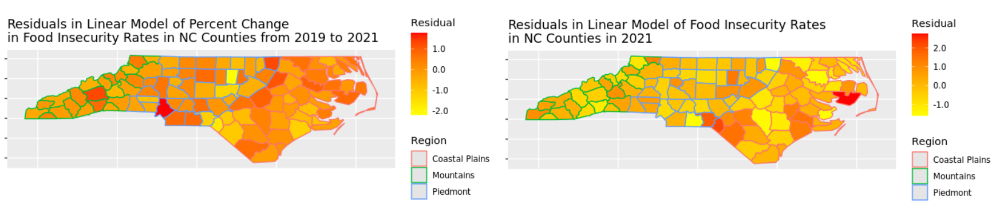
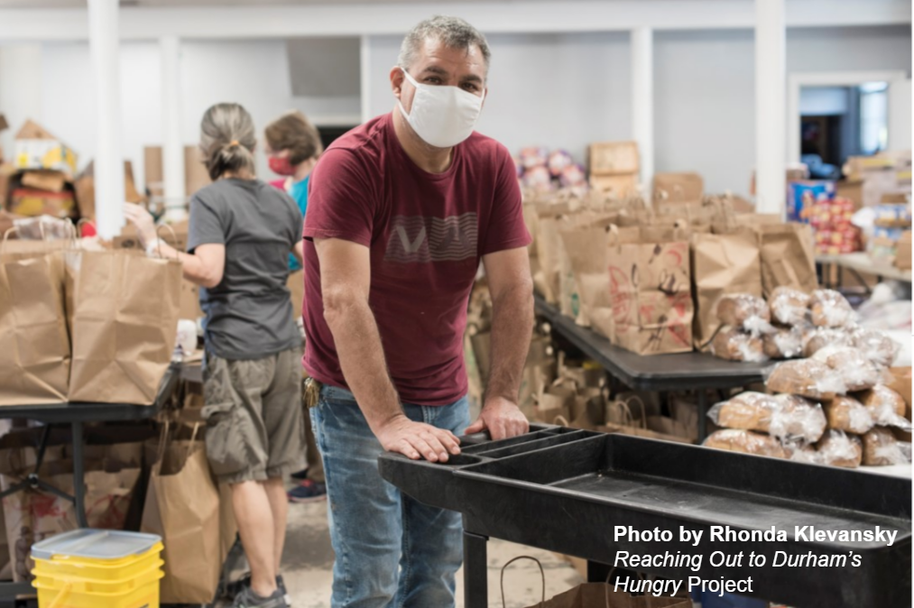

```{css, echo = FALSE}
.remark-slide-content {
  font-size: 16px;
  padding: 10px 40px 10px 40px;
}
.remark-code, .remark-inline-code {
  background: #f0f0f0;
}
.remark-code {
  font-size: 16px;
}
.huge .remark-code { /*Change made here*/
  font-size: 150% !important;
}
.tiny .remark-code { /*Change made here*/
  font-size: 50% !important;
}
```

```{r load-packages, include = FALSE}
# Add any additional packages you need to this chunk
# Remove any packages from this list that you're not using
library(tidyverse)
library(tidymodels)
library(knitr)
library(xaringanthemer)
library(xaringan)
library(tidyverse) 
library(readxl)
library(tinytex)
library(infer)
library(spdep)
library(lme4)
library(readr)
library(ggfortify)
library(haven)
library(yardstick)
library(broom)
```

```{r setup, include=FALSE}
# For better figure resolution
knitr::opts_chunk$set(
  fig.retina = 3, 
  dpi = 300, 
  fig.width = 6, 
  fig.asp = 0.618, 
  out.width = "70%"
  )
# code sources for this from: https://community.rstudio.com/t/using-multiple-font-sizes-for-code-chunks/26405
```

```{r load-data, include=FALSE}
library(readxl)
finc <- read_excel("~/R/Team-E-T/data/finc.xlsx", sheet = " County Projections")

finc_glimpse <- finc

finc <- finc %>%
  mutate(`x100 FI 2019 Percent` = `FI 2019 Percent`* 100) %>%
  mutate(`x100 2021 FI Percent` = `2021 FI Percent`* 100)

finc <- finc %>%
  mutate(FI_Diff=`x100 2021 FI Percent`-`x100 FI 2019 Percent`) %>%
  mutate(FI_PC_Change= (FI_Diff/`FI 2019 Percent`))

finc <- finc %>%
  mutate(`Rural-urban Continuum Code`, Urban_cat = ifelse(`Rural-urban Continuum Code`%in% c("1","2","3"), "Urban", "Rural"))

finc$Urban_cat <- as_factor(finc$Urban_cat)
finc$Urban_cat=relevel(finc$Urban_cat, ref = "Urban")

finc <- finc %>%
  mutate(Greater10pc_change_FI_Diff = if_else(`FI_PC_Change`< 10, "0", "1"))

finc$Greater10pc_change_FI_Diff <- as_factor(finc$Greater10pc_change_FI_Diff)
finc$Greater10pc_change_FI_Diff=relevel(finc$Greater10pc_change_FI_Diff, ref = "0")

finc$Region <- as_factor(finc$Region)
finc$Region=relevel(finc$Region, ref = "Piedmont")
```

```{r style-slides, echo = FALSE}
style_xaringan(
  title_slide_background_image = "img/darkfield.jpg"
)
```


## Introduction to Food Insecurity in NC

- Food insecurity is defined by the Food and Agriculture Organization of the United Nations as lack of "regular access to enough safe and nutritious food for normal growth and development and for an active and healthy life." (Source: https://www.feedingamerica.org/research/map-the-mealgap/by-county)

- Inspired by a desire to investigate COVID-19's impact on Food Security in North Carolina, a growing and diversifying state that serves as a pertinent case study to the factors impacting multiple dimensions of both **2021 food insecurity rates** and **food insecurity percent change** for North Carolina based on county data

- **T-Test** and **Linear Regression** run based on response variables of 2021 food insecurity rates and food insecurity percent change for North Carolina based on county data and **Logistic Regression** based on derived binary predictor variable of North Carolina counties with a food insecurity rate percent change greater than 10%

```{r maps, echo = FALSE, out.width = "125%", fig.align = "center"}
include_graphics("img/finc_maps.png")
```

---

## Dataset Glimpse

```{r glimpse-data, echo=FALSE}
glimpse(finc_glimpse)
```

---

## T-Test: Food Insecurity Rates from 2019 to 2021

- The following null hypothesis was used: $H_0: \pi_{2019} = \pi_{2021}$, versus $H_A: \pi_{2019} \neq \pi_{2021}$

```{r t-test-1, echo=FALSE}
t.test(finc$FI_Diff, mu=0) %>%
  tidy() %>%
knitr::kable(caption= "1 Sample Paired 2-Sided T-Test Testing Null Hypothesis of a True Percent Difference from 2019 to 2021 Food Insecurity Rates for NC Counties")

```


```{r t-test-2, echo=FALSE}
t.test(finc$FI_PC_Change, mu=0) %>%
  tidy() %>%
knitr::kable(caption= "1 Sample 2-Sided T-Test Testing Null Hypothesis of a True Percent Change from 2019 to 2021 Food Insecurity Rates for NC Counties")
```


- Using $\alpha = 0.05$, there is significance to support the conclusion that there was a significant increase in NC county food insecurity rates from 2019 to 2021 of **at least 1%** and a percent change of **at least 9%**.

---

## Linear Regression Exploration and Equation

- Regression Model:
$$\hat{y}_i = \hat{\beta}_0 + \hat{\beta}_1(meal_i) + \hat{\beta}_2(urban_i) + \hat{\beta}_3({\Delta}unemp_i) + \hat{\beta}_4(<hs_i) + 
\hat{\beta}_5({=}hs_i) + \hat{\beta}_6(somecollege_i) + \hat{\beta}_7(degree_i)$$
$$+ \hat{\beta}_8(hhincome_i) + \hat{\beta}_9(region_i) + \hat{\beta}_{10}(internet_i) + \hat{\beta}_{11}(hispanic_i) + \hat{\beta}_{12}(white_i)$$

```{r residspatial, echo = FALSE, out.width = "100%", fig.align = "center"}

```

---

## Main Linear Regression Results: Percent Change

```{r run_regression_0, message = FALSE, warning = FALSE, echo = FALSE, fig.show='hide'}

finc$Region=as.factor(finc$Region)

finc$Region=relevel(finc$Region, ref = "Piedmont")

finc_linear_1 <- linear_reg() %>%
  set_engine("lm") %>%
  fit(`FI_PC_Change` ~ `2019 Cost per Meal` + `Urban_cat` + `Unemployment Change` + `Percent Less than HS` + `HS or GED` + `Some College, No Degree` + `Household Income` + `Region` + `Percent Broadband Internet at Home` + `Hispanic` + `Percent non-Hispanic White`, data = finc)

finc_linear_1 %>% tidy(conf.int=TRUE) %>% 
select(term, estimate, p.value, conf.low, conf.high) %>%
knitr::kable(caption="Findings of Main Linear Regression of Food Insecurity Change in North Carolina, 2019-2021")
```

---

## Main Linear Regression Results: 2021 Food Insecurity Rate

```{r run_regression_1, echo=FALSE}
finc_linear_2 <- linear_reg() %>%
  set_engine("lm") %>%
  fit(`x100 2021 FI Percent` ~ `2019 Cost per Meal` + `Urban_cat` + `Unemployment Change` + `Percent Less than HS` + `HS or GED` + `Some College, No Degree` + `Household Income` + `Region` + `Percent Broadband Internet at Home` + `Hispanic` + `Percent non-Hispanic White`, data = finc)

finc_linear_2 %>% tidy(conf.int=TRUE) %>% 
select(term, estimate, p.value, conf.low, conf.high) %>%
knitr::kable(caption="Findings of Main Linear Regression of Food Insecurity Rates by NC County, 2021")
```

---

## Linear Regression Extended Results

- Used only significant predictor variables for both response variables (**2021 food insecurity rates** and **food insecurity percent change** for North Carolina based on county data) to develop new linear regression model, and testing different combinations of interaction terms to determine the greaterst rise in $R^2_{adj}$ from Main to Interaction Model.

Percent Change with Significant Variables and Interaction Effects Between `Household Income` * `Unemployment Change`

$R^2_{adj}$ Value: Main
```{r r-squared-1, echo=FALSE}
glance(finc_linear_1)$adj.r.squared
```

$R^2_{adj}$ Value: Interaction
```{r r-squared-3, echo=FALSE}
finc_linear_3 <- linear_reg() %>%
  set_engine("lm") %>%
  fit(`FI_PC_Change` ~ `Urban_cat` + `Percent non-Hispanic White` + `Household Income` * `Unemployment Change`  + `Region` , data = finc)

glance(finc_linear_3)$adj.r.squared
```

2021 Rate with Significant Variables and Interaction Effects Between `Household Income` * `Unemployment Change`

$R^2_{adj}$ Value: Main
```{r r-squared-2, echo=FALSE}
glance(finc_linear_2)$adj.r.squared
```

$R^2_{adj}$ Value: Interaction
```{r r-squared-4, echo=FALSE}
finc_linear_4 <- linear_reg() %>%
  set_engine("lm") %>%
  fit(`x100 2021 FI Percent` ~ `Unemployment Change` * `Household Income` + `Percent Less than HS` + `Region`, data = finc)

glance(finc_linear_4)$adj.r.squared
```

---

## Logistic Regression Model Exploration and Equation

```{r stacked, echo = FALSE, out.width = "125%", fig.align = "center"}
include_graphics("img/finc_2stacked.png")
```

- A logistic regression model was developed to graph **food insecurity rate percent change of greater than 10%** in food insecurity from 2019 to 2021 in NC counties where `urban` refers to a binary urban or non-urban, while `region` refers to a categorical variable with three levels and the Piedmont Region as the referent group.

- Regression Model:
$$\log(\frac{\pi_i}{1-\pi_i}) = \hat{\beta}_0 + \hat{\beta}_1(urban_i) + \hat{\beta}_2(region_i) $$
---

## Logistic Regression Model Results

```{r run_log_regression_1, message = FALSE, warning = FALSE, echo = FALSE}

fs_percentchange_1_fit <- logistic_reg() %>%
  set_engine("glm") %>%
  fit(Greater10pc_change_FI_Diff ~ Urban_cat + Region, data = finc, family = "binomial")
tidy(fs_percentchange_1_fit,conf.int=TRUE) %>%
  mutate(
    odds = exp(estimate),
    conf.low.exp = exp(conf.low),
    conf.high.exp = exp(conf.high)
  ) %>% 
  select(term, odds, p.value, conf.low.exp, conf.high.exp) %>%
knitr::kable(caption="Results of Logistic Regression Table Determining Odds 
of Food Security Change During Pandemic Greater than 10% by Urban-Rural Status")
```

- There is a significantly **lower odds** of having a percent change in food insecurity rates from 2019 to 2021 of greater than 10% for **rural** counties opposed to urban counties and for **both Coastal Plains and Mountains** Counties opposed to Piedmont Counties

---

## Thank You! :)

```{r final, echo = FALSE, out.width = "65%", fig.align = "center"}

```