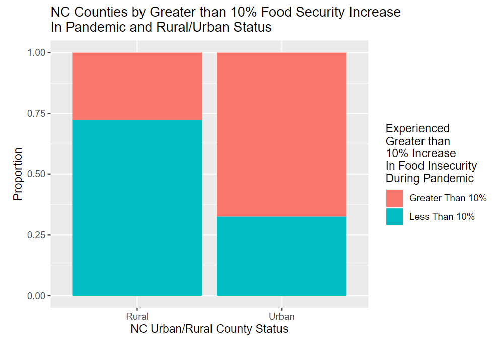

```{r load-packages, include = FALSE}
# Add any additional packages you need to this chunk
# Remove any packages from this list that you're not using
library(tidyverse)
library(tidymodels)
library(palmerpenguins)
library(knitr)
library(xaringanthemer)
library(xaringan)
library(readxl)
```

```{r setup, include=FALSE}
# For better figure resolution
knitr::opts_chunk$set(
  fig.retina = 3, 
  dpi = 300, 
  fig.width = 6, 
  fig.asp = 0.618, 
  out.width = "70%"
  )
```

```{r load-data, include=FALSE}
finc <- read_excel("~/R/Team-E-T/data/finc.xlsx", sheet = " County Projections")
```

```{r style-slides, echo = FALSE}
style_xaringan(
  title_slide_background_image = "img/darkfield.jpg"
)
```

class: inverse, middle, center

# Background and Research Questions

---

## Food Insecurity

- Food insecurity is defined by the Food and Agriculture Organization of the United Nations as lack of "regular access to enough safe and nutritious food for normal growth and development and for an active and healthy life."

--

- Project inspired by a desire to investigate COVID-19's impact on Food Security in North Carolina, a growing and diversifying state that serves as a pertinent case study to the factors impacting multiple dimensions of food insecurity rates

```{r maps, echo = FALSE, out.width = "125%", fig.align = "center"}
include_graphics("img/finc_maps.png")
```
---

## Research Questions

- Does North Carolina County level data provide evidence to support that there has been a statistically significant change to food insecurity rates from 2019 to 2021, and if there is support, what is the magnitude of this change?

- To what extent are the following variables able to predict North Carolinian county-level food insecurity rates and the rate's change from 2019 to 2021: unemployment change from 2019-2021, meal price in 2019, education level, level of broadband internet, race and ethnicity, and degree of urbanization? Are some variables better predictors of rate versus rate change and vice versa? Which variables are not strong predictors at all? Are any statistically but not practically significant?

- Finally, if there is evidence to support that there has been a statistically significant change to food insecurity rates from 2019 to 2021, to what extent are categorical variables of urban/rural status and NC Region able to predict a percent change of greater than 10% in food insecurity from 2019 to 2021, signifying a greater understanding into the most impacted areas of North Carolina during the two year period?

---
## T-Test Exploration


---
## Linear Regression Exploration
```{r boxplots, echo = FALSE, out.width = "125%", fig.align = "center"}
include_graphics("img/finc_boxplots.png")
```

$$\hat{y}_i = \hat{\beta}_0 + \hat{\beta}_1(meal_i) + \hat{\beta}_2(urban_i) + \hat{\beta}_3({\Delta}unemp_i) + \hat{\beta}_4(<hs_i) + 
\hat{\beta}_5({=}hs) + \hat{\beta}_6(somecollege) + \hat{\beta}_7(degree)$$
$$+ \hat{\beta}_8(hhincome) + \hat{\beta}_9(region) + \hat{\beta}_{10}(internet) + \hat{\beta}_{11}(hispanic) + \hat{\beta}_{12}(white)$$

---
## Logistic Regression Exploration
```{r stacked, echo = FALSE, out.width = "50%", fig.align = "center"}

```

$$\log(\frac{\pi_i}{1-\pi_i}) = \hat{\beta}_0 + \hat{\beta}_1(urban_i) + \hat{\beta}_2(region_i) $$

---
## Layouts

You can use plain text

- or bullet points

.pull-left[
or text in two columns $^*$
]
.pull-right[
- like
- this
]

.footnote[
[*] And add footnotes
]

---

## Code

```{r boring-regression}
# a boring regression
model <- lm(dist ~ speed, data = cars)
tidy(model)
glance(model)
```

---

## Plots

```{r recode-species, echo = FALSE}
# In this chunk I'm doing a bunch of analysis that I don't want to present 
# in my slides. But I need the resulting data frame for a plot I want to present.
penguins_modified <- penguins %>%
  mutate(species = fct_other(species, keep = "Adelie"))
```

```{r plot-penguins, echo = FALSE, warning = FALSE, fig.alt = "Body mass vs. flipper lenght of Palmer Penguins for species Adelie and all the others combined together. There is a relatively strong, positive relationship between the two variables. The Adelie penguins are clustered together but they don't exhibit a different trend than the rest of the penguins."}
# Code hidden with echo = FALSE
# Uses modified penguins dataset from previous chunk
# Play around with height and width until you're happy with the look
ggplot(penguins_modified, aes(x = flipper_length_mm, y = body_mass_g, color = species)) +
  geom_point() + 
  theme_minimal()
```

---

## Plot and text

.pull-left[
- Some text
- goes here
]
.pull-right[
```{r warning=FALSE, out.width="100%", fig.width=4, echo=FALSE}
# see how I changed out.width and fig.width from defaults
# to make the figure bigger
ggplot(penguins, aes(x = bill_length_mm, y = species, color = species)) +
  geom_boxplot() +
  theme_minimal()
```
]

---

class: inverse, middle, center

# A new section...

---

## Tables

If you want to generate a table, make sure it is in the HTML format (instead of Markdown or other formats), e.g.,

```{r penguins-table, echo = FALSE}
kable(head(penguins), format = "html")
```

---

## Images

```{r castle, echo = FALSE, out.width = "40%", fig.align = "center", fig.cap = "Image credit: Danielle Navarro, Percolate."}
include_graphics("img/watercolour_sys02_img32_percolate.jpg")
```

Or you can also include a full page image. See next slide.

---

background-image: url(img/watercolour_sys02_img32_percolate.jpg)

---

## Math Expressions

You can write LaTeX math expressions inside a pair of dollar signs, e.g. &#36;\alpha+\beta$ renders $\alpha+\beta$. You can use the display style with double dollar signs:

```
$$\bar{X}=\frac{1}{n}\sum_{i=1}^nX_i$$
```

$$\bar{X}=\frac{1}{n}\sum_{i=1}^nX_i$$

Limitations:

1. The source code of a LaTeX math expression must be in one line, unless it is inside a pair of double dollar signs, in which case the starting `$$` must appear in the very beginning of a line, followed immediately by a non-space character, and the ending `$$` must be at the end of a line, led by a non-space character;

1. There should not be spaces after the opening `$` or before the closing `$`.

1. Math does not work on the title slide (see [#61](https://github.com/yihui/xaringan/issues/61) for a workaround).

---

class: inverse, middle, center

# Wrap up

---

## Feeling adventurous?

- Want to find out more about `xaringan`? See https://slides.yihui.name/xaringan/#1.

- You are welcomed to use the default styling of the slides. In fact, that's what I expect the majority of you will do. You will differentiate yourself with the content of your presentation.

- But some of you might want to play around with slide styling. The 
`xaringanthemer` provides some solutions for this that: https://pkg.garrickadenbuie.com/xaringanthemer.

- And if you want more bells and whistles, there is also `xaringanExtra`: https://pkg.garrickadenbuie.com/xaringanExtra.
